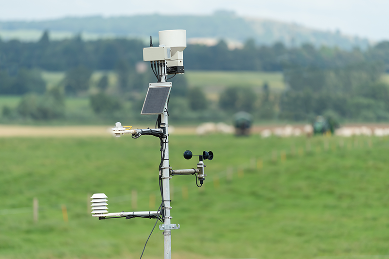
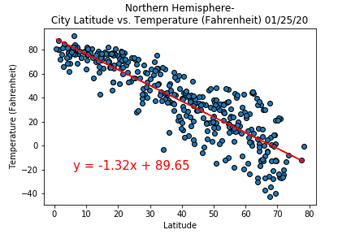

# WeatherPy
----
This notebook will be creating a Python script to visualize the weather of 500+ cities across the world of varying distance from the equator. To accomplish this, we'll be utilizing a [simple Python library](https://pypi.python.org/pypi/citipy), the [OpenWeatherMap API](https://openweathermap.org/api), and a little common sense to create a representative model of weather across world cities.

We will seek to find if there is a correlation between one of four weather measures and latitude. The four weather measures are Temperature, Humidity, Cloudiness and Wind Speed. Imperial units will be utilized.

Our first analysis will examine all latitudes against each weather measure. Then we will segment our dataset into Northern and Southern Hemisphere data and see if we are able to get a stronger correlation to the weather measures.

This final notebook will contain:

* At least 500 randomly selected unique (non-repeat) cities based on latitude and longitude.
* A weather check on each of the cities found randomly using a series of successive API calls to Openweather.org.
* A printed log of each city as it's being processed with the city ID and city name.
* A saved CSV file of all retrieved data
* A PNG image for each scatter plot (saved in the "Figures" folder)

# Analysis and observations

Of the four weather measures examined versus changes in latitude the strongest correlation was found between Northern Hemisphere changes in latitude versus temperature. This relationship had a high r-squared value of 0.87 meaning that 87% of the variance in this data could be explained by the equation of the line from linear regression. 

Of the relationships examined there were some weak correlations with r-squared values of around 0.4 and others below that - which indicated that there wasn't a correlation:
* Northern Hemisphere - Temperature (F) vs. Latitude     r-squared -0.87
* Southern Hemisphere - Temperature (F) vs. Latitude     r-squared  0.42     
* Northern Hemisphere - Humidity (%) vs. Latitude        r-squared  0.29
* Southern Hemisphere - Humidity (%) vs. Latitude        r-squared  0.42
* Northern Hemisphere - Cloudiness (%) vs. Latitude      r-squared  0.19
* Southern Hemisphere - Cloudiness (%) vs. Latitude      r-squared  0.39
* Northern Hemisphere - Wind Speed (mph) vs. Latitude    r-squared  0.07
* Southern Hemisphere - Wind Speed (mph) vs. Latitude    r-squared -0.41

